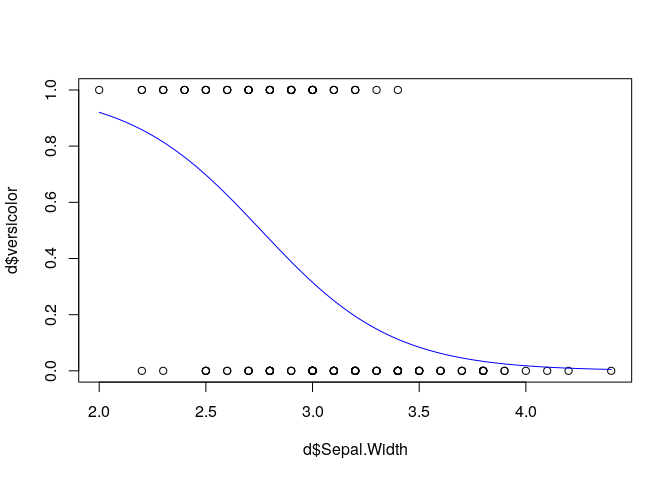
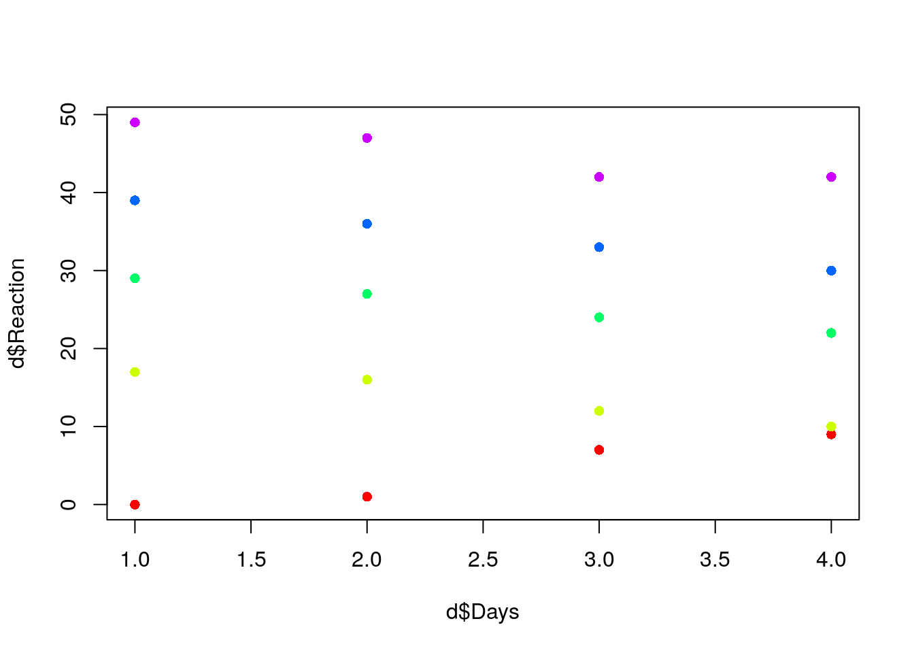
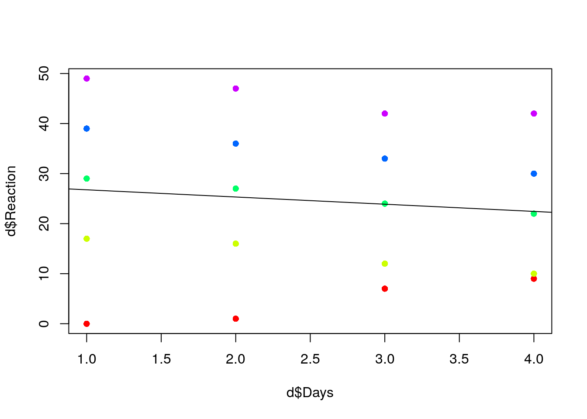
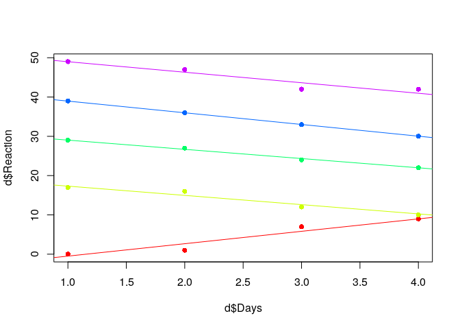

Advanced Statistical Modeling in R
================
Kasper Welbers & Wouter van Atteveldt
November 2018

-   [Advanced Modeling](#advanced-modeling)
-   [Generalized linear models](#generalized-linear-models)
    -   [Logistic regression](#logistic-regression)
-   [Multilevel models, or Mixed-Effects models](#multilevel-models-or-mixed-effects-models)
    -   [Multilevel modeling in R: a visual explanation](#multilevel-modeling-in-r-a-visual-explanation)
        -   [Regular linear model](#regular-linear-model)
        -   [Multilevel model with random intercepts](#multilevel-model-with-random-intercepts)
        -   [Multilevel model with random intercepts and random slopes](#multilevel-model-with-random-intercepts-and-random-slopes)
        -   [Comparing multilevel models](#comparing-multilevel-models)
    -   [Multilevel Logistic or Poisson regression with glmer()](#multilevel-logistic-or-poisson-regression-with-glmer)

Advanced Modeling
=================

In this tutorial we show how to perform several advanced statistical models in R. For the sake of parsimony, we will not discuss each model in detail, but only point out the main usage and provide a general example.

For this tutorial we use the tidyverse and texreg package to manage the data and present the models. For the statistical models we use the stats packages (loaded by default) and the amazing [lme4](https://cran.r-project.org/web//packages/lme4/vignettes/lmer.pdf) package

``` r
library(tidyverse)
library(texreg)
library(lme4)    ## remember to install first
```

Generalized linear models
=========================

> In statistics, the generalized linear model (GLM) is a flexible generalization of ordinary linear regression that allows for response variables that have error distribution models other than a normal distribution. The GLM generalizes linear regression by allowing the linear model to be related to the response variable via a link function and by allowing the magnitude of the variance of each measurement to be a function of its predicted value. [Wikipedia](https://en.wikipedia.org/wiki/Generalized_linear_model)

Probably the most common use of generalized linear models is the logistic regression, or binary regression, that allows for a dichotomous response variable. Another common use is the Poisson regression, which allows for a response variable with a Poisson distribution.

Generalized linear models can be performed with the regular stats package, in a way that is very similar to the regular linear models. Where regular linear models have the `lm` function, generalized linear models have the `glm` function. Other than this, the main difference is that the family function, or link function, of the glm needs to be given.

Logistic regression
-------------------

First, we create a copy of the iris data, but with a dichotomous variable for whether a case (row) is of the species "versicolor".

``` r
d = mutate(iris, versicolor = as.numeric(Species == 'versicolor'))
head(d)
```

|  Sepal.Length|  Sepal.Width|  Petal.Length|  Petal.Width| Species |  versicolor|
|-------------:|------------:|-------------:|------------:|:--------|-----------:|
|           5.1|          3.5|           1.4|          0.2| setosa  |           0|
|           4.9|          3.0|           1.4|          0.2| setosa  |           0|
|           4.7|          3.2|           1.3|          0.2| setosa  |           0|
|           4.6|          3.1|           1.5|          0.2| setosa  |           0|
|           5.0|          3.6|           1.4|          0.2| setosa  |           0|
|           5.4|          3.9|           1.7|          0.4| setosa  |           0|

The `glm` function uses the same type of formula as the `lm` function: `dependent ~ independent1 + independent2 + ...`. Here we try to predict whether the species is `versicolor` based on the Sepal size (length and width). We specify that we use the `binomial` family, for modeling a binomial dependent variable. To view the model we again use the texreg package (but summary(m) would also work).

``` r
m = glm(versicolor ~ Sepal.Length + Sepal.Width, family = binomial, data = d)
screenreg(m)
```

    ## 
    ## ==========================
    ##                 Model 1   
    ## --------------------------
    ## (Intercept)       8.09 ***
    ##                  (2.39)   
    ## Sepal.Length      0.13    
    ##                  (0.25)   
    ## Sepal.Width      -3.21 ***
    ##                  (0.64)   
    ## --------------------------
    ## AIC             157.65    
    ## BIC             166.68    
    ## Log Likelihood  -75.83    
    ## Deviance        151.65    
    ## Num. obs.       150       
    ## ==========================
    ## *** p < 0.001, ** p < 0.01, * p < 0.05

Here we see that only Sepal.Width has a significant effect. The smaller the Sepal.Width, the more likely that the species is Versicolor.

Note that there is no R2 value, because the glm model is fit with a maximum likelihood estimator instead of the least squares approach used in regular lm. To evaluate model fit, you can compare models using the anova function. For example, here we first make a base model that does not contain any independent variables (other than the intercept), and also make a second model with the Petal information included. We then compare how the model fit changes.

``` r
m_base = glm(versicolor ~ 1, family = binomial, data = d)
m1 = glm(versicolor ~ Sepal.Length + Sepal.Width, family = binomial, data = d)
m2 = glm(versicolor ~ Sepal.Length + Sepal.Width + Petal.Length + Petal.Width, family = binomial, data = d)
anova(m_base, m1,m2, test="Chisq")
```

|  Resid. Df|  Resid. Dev|   Df|   Deviance|  Pr(&gt;Chi)|
|----------:|-----------:|----:|----------:|------------:|
|        149|    190.9543|   NA|         NA|           NA|
|        147|    151.6504|    2|  39.303827|    0.0000000|
|        145|    145.0697|    2|   6.580749|    0.0372399|

We can see that adding the variables improves the model fit, in particular for m1, but also for m2. The chi2 test shows whether the change in the model fit is statistically significant for consequtive models (m\_base to m1, and m1 to m2). If we look at the model, we also see that Petal.Width is a significant predictor.

``` r
screenreg(list(m1,m2))
```

    ## 
    ## ======================================
    ##                 Model 1     Model 2   
    ## --------------------------------------
    ## (Intercept)       8.09 ***    7.38 ** 
    ##                  (2.39)      (2.50)   
    ## Sepal.Length      0.13       -0.25    
    ##                  (0.25)      (0.65)   
    ## Sepal.Width      -3.21 ***   -2.80 ***
    ##                  (0.64)      (0.78)   
    ## Petal.Length                  1.31    
    ##                              (0.68)   
    ## Petal.Width                  -2.78 *  
    ##                              (1.17)   
    ## --------------------------------------
    ## AIC             157.65      155.07    
    ## BIC             166.68      170.12    
    ## Log Likelihood  -75.83      -72.53    
    ## Deviance        151.65      145.07    
    ## Num. obs.       150         150       
    ## ======================================
    ## *** p < 0.001, ** p < 0.01, * p < 0.05

For reference, it is possible to get some sort of R2 value, often called the pseudo R2. See for instance [this page](https://stats.idre.ucla.edu/other/mult-pkg/faq/general/faq-what-are-pseudo-r-squareds/) for a discussion and overview. If you want to use it though, do not waste time figuring out how to calculate it, but rather look for a package that can do it for you (there are certain to be plenty).

Finally, to illustrate how fitting a `glm` is different from using a regular `lm`, we can plot the regression line for the Sepal.Width. To keep it simple, we'll fit a model with only the Sepal.Width as predictor.

``` r
## create model
m = glm(versicolor ~ Sepal.Width, family = binomial, data = d)

## create a sequence of values within the observed boundaries of Sepal.Width
x = seq(min(d$Sepal.Width), max(d$Sepal.Width), 0.01)     

## predict response (probability of species being 'versicolor') for the values in x
y = predict(m, list(Sepal.Width = x), type = 'response')  

## plot the actual values for versicolor
plot(d$Sepal.Width, d$versicolor)

## add the predicted values
lines(x,y, col='blue')
```



here we see that the versicolor cases (the dots at the top and bottom) are mostly on the left side (small Sepal Width). The curved prediction line shows that the probability approaches (but never exceeds) 1 the smaller the Sepal.Width gets, and approaches 0 the larger the Sepal.Width gets. In a regular `lm`, this line would be straight, which is less suited for fitting the probability, and would arbitrarily have values higher than 1 and lower than 0.

Multilevel models, or Mixed-Effects models
==========================================

Multilevel models are, simply put, linear models that can account for multiple levels in the data. Here we briefly explain what what multilevel analysis in and how to apply it in R with the `lme4` package.

The examples in the lme4 packages use the sleepstudy data, which measures reaction time of participants after sleep deprivation. The data contains three variables: Reaction, Days and Subject. Subjects were limited to 3 hours of sleep each night, so the question is whether their reaction time slows after more days of limited sleep.

``` r
head(sleepstudy)
```

|  Reaction|  Days| Subject |
|---------:|-----:|:--------|
|  249.5600|     0| 308     |
|  258.7047|     1| 308     |
|  250.8006|     2| 308     |
|  321.4398|     3| 308     |
|  356.8519|     4| 308     |
|  414.6901|     5| 308     |

The sleepstudy data requires multilevel analysis, because the observations are nested in Subjects. Linear regression models assume that observations are independent, but that is not the case here. Different subjects might have different reaction speeds in general, and might also be more or less affected by sleep deprivation.

To account for this, multilevel models can have `random intercepts` and `random slopes`. By using random intercepts, each Subject has its own intercept, which accounts for differences between subjects in overall reaction speed. Random slopes can be applied for each independent variable in the model, so that each Subject also has its own slope (i.e. coefficient) for this variable. This can be used simply to controll for implications of nested data (to not violate the independence assumption in linear regression). But moreover, it can be used to better investigate variance and effects at different levels. For instance, to what extent student learning success is explained by individual level factors (doing homework, participating in class) or class level factors (class size, experience of teacher).

Multilevel modeling in R: a visual explanation
----------------------------------------------

We will not try to explain exactly what a multilevel model is and when and how you should use it (this would be a workshop in itself). The main goal here is to show how to perform multilevel modeling in R, and to visually illustrate what happens when you add higher level variables to a linear model. For this we'll use toy data in which the random intercepts (and slopes) are extremely obvious. We'll stick to the names of the sleepstudy data for sake of simplicity.

``` r
d = data.frame(Reaction = c(0,1,7,9,17,16,12,10,29,27,24,22,39,36,33,30,49,47,42,42),
               Days = c(1,2,3,4,1,2,3,4,1,2,3,4,1,2,3,4,1,2,3,4),
               Subject = c(1,1,1,1,2,2,2,2,3,3,3,3,4,4,4,4,5,5,5,5))
```

Here the Subjects have clearly different intercepts (average Reaction) and slopes (effect of Days on Reaction). We can show this with a scatterplot, in which different subjects are given different colors.

``` r
cols = rainbow(5)  # make colors for 5 subjects
plot(d$Days, d$Reaction, col=cols[d$Subject], pch=16)
```



If we just look at the dots without the colors, we hardly see any patterns. Taking the colors into account, we see that the average reaction time (in our toy data) is vastly different for each Subject. Also, we see that overall the reaction time within Subjects decrease for most Subjects, but with different slopes, and one even increases.

To show how we can model this with random intercepts and random slopes, we'll fit this data with three models: regular linear model, multilevel model with random intercepts, multilevel model with random slopes.

### Regular linear model

Let's see what happens if we fit a regular linear regression, and plot the regression line.

``` r
m = lm(Reaction ~ Days, data=d)
screenreg(m)
```

    ## 
    ## =====================
    ##              Model 1 
    ## ---------------------
    ## (Intercept)  28.20 **
    ##              (8.50)  
    ## Days         -1.44   
    ##              (3.11)  
    ## ---------------------
    ## R^2           0.01   
    ## Adj. R^2     -0.04   
    ## Num. obs.    20      
    ## RMSE         15.53   
    ## =====================
    ## *** p < 0.001, ** p < 0.01, * p < 0.05

The model states that there is no relation between Days and Reaction. We can visualize the problem of fitting a regular linear model to this data by adding the coefficient line to the plot.

``` r
plot(d$Days, d$Reaction, col=cols[d$Subject], pch=16)
abline(coef(m)[1], coef(m)[2])
```



It does captures the overal pattern (Reaction times goes down), but only roughly.

### Multilevel model with random intercepts

To fit a linear multilevel model we will use the `lmer` function from the `lme4` package. Notice the similarity to the `lm` function.

The difference is that you need to specify the higher level in the formula, which looks like this.

``` r
m_ri = lmer(Reaction ~ Days + (1 | Subject), data=d)
```

The multilevel part is the added `+ (1 | Subject)`. The part between the parentheses has two parts:

-   The part after the | symbol gives the name of the higher level group, in this case Subject.
-   The part before the | specifies the model for this higher level. In the current example, this is only `1`, which referes to the intercept. Normally, the intercept is implicit, but here you do always need to specify it.

Here we can also use the `screenreg` function (from the `texreg` package) to print the regression table.

    screenreg(m_ri)

Interestingly, we see that the intercept and the effect for Days is identical (though now the effect is Days statistically significant). This part of the output still shows the overall intercept (or grand intercept) and effect. What's new is the lower part, which shows the way the model is fit and the random effects. As with the `glm` we see that there is no R2. To evaluate the model fit the common approach is to compare different models.

For now, focus on the `Var: Subject (Intercept)` and `Var: Residual` rows. These report the variance for the two levels (The residual is the variance at the level of individual observations). We see that the Subject variance (259.00) is much higher than the Residual variance (10.83). This makes sense for our data, because the biggest differences in the Reaction scores can be explained by the differences between Subjects. We can see this more clearly by visualizing the effect of Days with the random interceps. The random intercept values are not reported in the model above, but they are stored in the output (m\_ri).

``` r
plot(d$Days, d$Reaction, col=cols[d$Subject], pch=16)
for (i in 1:5) {  ## for each subject
  abline(coef(m_ri)$Subject[i,1], coef(m_ri)$Subject[i,2], col=cols[i])
}
```


Now each Subject has it's own regression line for the effect of Days on Reaction. This also makes it clear why the variance is mainly on the Subject level. The distance of the observations (the dots) to the lines of the same colour is relatively small. The bigger distance is between the lines.

### Multilevel model with random intercepts and random slopes

In the random intercepts model the slope for the effect of Days is still the same. So now, let's fit the model with random intercepts AND random slopes. We do this by adding the Days variable in the multilevel part (the part between parentheses) of the formula.

``` r
m_rs = lmer(Reaction ~ Days + (1 + Days| Subject), data=d)
screenreg(m_rs)
```

    ## 
    ## ========================================
    ##                                Model 1  
    ## ----------------------------------------
    ## (Intercept)                     28.20 **
    ##                                 (9.61)  
    ## Days                            -1.44   
    ##                                 (1.19)  
    ## ----------------------------------------
    ## AIC                            108.58   
    ## BIC                            114.55   
    ## Log Likelihood                 -48.29   
    ## Num. obs.                       20      
    ## Num. groups: Subject             5      
    ## Var: Subject (Intercept)       460.54   
    ## Var: Subject Days                6.87   
    ## Cov: Subject (Intercept) Days  -48.40   
    ## Var: Residual                    1.02   
    ## ========================================
    ## *** p < 0.001, ** p < 0.01, * p < 0.05

Again, the fixed effects for the Intercept and Days are the same. What is new is that the variance of `Subject Days` is reported. This is the variance between Subject in the effect of Days on Reaction. In our data, this variance is most clearly seen in the effect for the 'red' Subject at the bottom of the graph, which is the only Subject for whom Reaction time somehow increased.

``` r
plot(d$Days, d$Reaction, col=cols[d$Subject], pch=16)  ## redo the plot for clarity
for (i in 1:5) {  ## for each subject
  abline(coef(m_rs)$Subject[i,1], coef(m_rs)$Subject[i,2], col=cols[i])
}
```



### Comparing multilevel models

By comparing the models, we can see how the variance at different levels changes. Here we first make a base model, which is a random intercepts model without any predictor variables. Then we add Days at the individual level, and finally we add the random slopes for Days.

``` r
m_base = lmer(Reaction ~ (1 | Subject), data=d)
m1 = lmer(Reaction ~ Days + (1 | Subject), data=d)
m2 = lmer(Reaction ~ Days + (1 + Days| Subject), data=d)
anova(m_base,m1,m2)
```

|         |   Df|       AIC|       BIC|     logLik|  deviance|      Chisq|  Chi Df|  Pr(&gt;Chisq)|
|---------|----:|---------:|---------:|----------:|---------:|----------:|-------:|--------------:|
| m\_base |    3|  135.5236|  138.5108|  -64.76182|  129.5236|         NA|      NA|             NA|
| m1      |    4|  133.1133|  137.0962|  -62.55664|  125.1133|   4.410373|       1|      0.0357210|
| m2      |    6|  115.5772|  121.5516|  -51.78861|  103.5772|  21.536052|       2|      0.0000211|

The anova shows that each model is an improvement of the previous model. Interestingly, the improvement from m\_base to m1 is not that great. This is because the overall effect of Days (not taking random slopes into account) isn't that great (remember that it was not statistically significant)

``` r
screenreg(list(m_base,m1,m2))
```

    ## 
    ## ================================================================
    ##                                Model 1     Model 2     Model 3  
    ## ----------------------------------------------------------------
    ## (Intercept)                     24.60 ***   28.20 ***   28.20 **
    ##                                 (7.23)      (7.42)      (9.61)  
    ## Days                                        -1.44 *     -1.44   
    ##                                             (0.66)      (1.19)  
    ## ----------------------------------------------------------------
    ## AIC                            129.84      126.47      108.58   
    ## BIC                            132.83      130.45      114.55   
    ## Log Likelihood                 -61.92      -59.23      -48.29   
    ## Num. obs.                       20          20          20      
    ## Num. groups: Subject             5           5           5      
    ## Var: Subject (Intercept)       258.31      259.00      460.54   
    ## Var: Residual                   13.57       10.83        1.02   
    ## Var: Subject Days                                        6.87   
    ## Cov: Subject (Intercept) Days                          -48.40   
    ## ================================================================
    ## *** p < 0.001, ** p < 0.01, * p < 0.05

It is interesting to look at the random effects to see how the variance is explained at different levels. From m\_base to m1 (adding the Days effect) we see that variance is mostly explained at `Var: Residual`. This makes sense, because Days this is a within Subject variable. From m1 to m2 (adding the random slope for Days), we see that even more variance at the `Var: Residual` level is explained. This again makes sense, because the lines within the Subjects now much better fit the data. This variance can now be measured as variance between the slopes for Days, as seen in `VAR: Subject Days`.

Multilevel Logistic or Poisson regression with glmer()
------------------------------------------------------

The `lmer` function can be seen as the `lm` function for multilevel models. Similarly, the `lme4` package has the `glmer` function, which can be seen as the `glm` function for multilevel models. In terms of syntax, using `glmer` is very similar to `lmer`, and like in `glm`, you need to specify a `family` (e.g., binomial for logistic regression, poisson for poisson regression).
