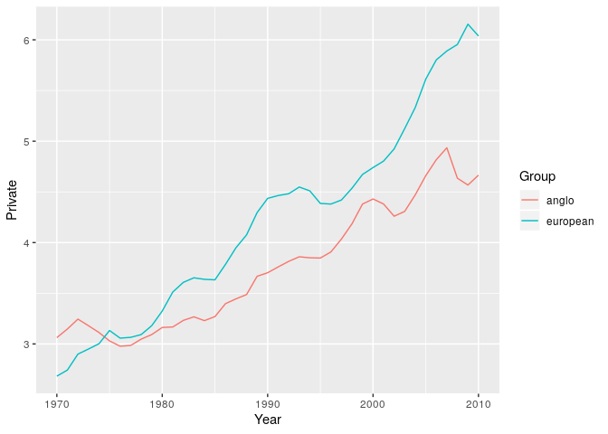
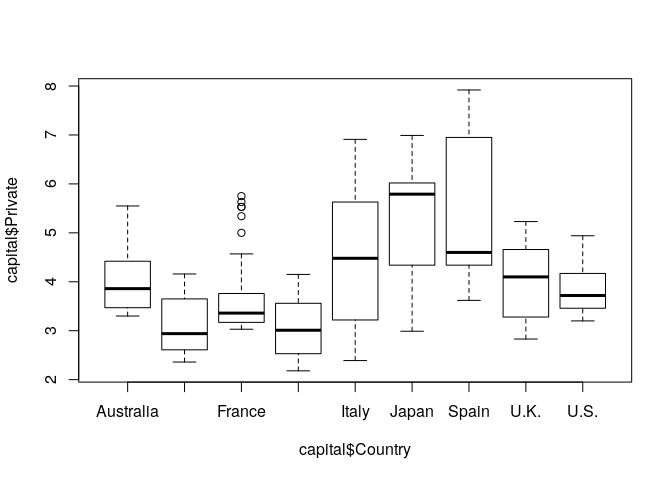
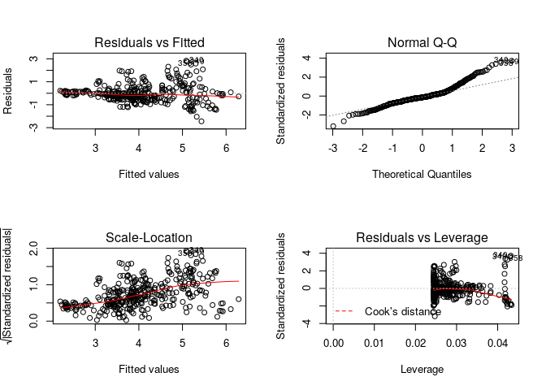

Simple Statistical Modeling in R
================
Wouter van Atteveldt & Kasper Welbers
November 2018

-   [Basic Modeling](#basic-modeling)
-   [T-tests](#t-tests)
-   [Anova](#anova)
-   [Linear models](#linear-models)
-   [Comparing and diagnosing models](#comparing-and-diagnosing-models)
-   [Jamovi](#jamovi)

Basic Modeling
==============

In this tutorial we use a file adapted from the data published by Thomas Piketty as a digital appendix to his book "Capital in the 21st Century". You can find the original files here: <http://piketty.pse.ens.fr/files/capital21c/en/xls/>, but to make things easier we've published a cleaned version of this data set on our repository.

``` r
library(tidyverse)
url = "https://raw.githubusercontent.com/ccs-amsterdam/r-course-material/master/data/piketty_capital.csv"
capital = read_csv(url)
head(capital)
```

|  Year| Country   |  Public|  Private|  Total|
|-----:|:----------|-------:|--------:|------:|
|  1970| Australia |    0.61|     3.30|   3.91|
|  1970| Canada    |    0.37|     2.47|   2.84|
|  1970| France    |    0.41|     3.10|   3.51|
|  1970| Germany   |    0.88|     2.25|   3.13|
|  1970| Italy     |    0.20|     2.39|   2.59|
|  1970| Japan     |    0.61|     2.99|   3.60|

This data set describes the accumulation of public and private capital per year for a number of countries, expressed as percentage of GDP. So, in Australia in 1970, the net assets owned by the state amounted to 61% of GDP.

In this tutorial we mainly use the `stats` package. This is loaded by default, so you do not need to call `library(stats)`.

T-tests
=======

First, let's split our countries into two groups, anglo-saxon countries and european countries (plus Japan): We can use the `ifelse` command here combined with the `%in%` operator

``` r
anglo = c("U.S.", "U.K.", "Canada", "Australia")
capital = mutate(capital, Group = ifelse(capital$Country %in% anglo, "anglo", "european"))
table(capital$Group)
```

|  anglo|  european|
|------:|---------:|
|    164|       205|

Now, let's see whether capital accumulation is different between these two groups. We use an (independent samples) T-test, where we use the *formula notation* (`dependent ~ independent`) to describe the model we try to test.

``` r
t.test(capital$Private ~ capital$Group)
```

    ## 
    ##  Welch Two Sample t-test
    ## 
    ## data:  capital$Private by capital$Group
    ## t = -4.6664, df = 289.34, p-value = 4.692e-06
    ## alternative hypothesis: true difference in means is not equal to 0
    ## 95 percent confidence interval:
    ##  -0.7775339 -0.3162154
    ## sample estimates:
    ##    mean in group anglo mean in group european 
    ##               3.748232               4.295106

So, according to this test capital accumulation is indeed significantly higher in European countries than in Anglo-Saxon countries.

Of course, the data here are not independently distributed since the data in the same year in different countries is related (as are data in subsequent years in the same country, but let's ignore that for the moment) We could also do a paired t-test of average accumulation per year per group by first using the cast command to aggregate the data. Note that we first remove the NA values (for Spain).

``` r
pergroup = capital %>% na.omit %>% group_by(Year, Group) %>% summarize(Private=mean(Private))
```

Let's plot the data to have a look at the lines:

``` r
library(ggplot2)
pergroup %>% ggplot + geom_line(aes(x=Year, y=Private, colour=Group))
```



So initially capital is higher in the Anglo-Saxon countries, but the European countries overtake quickly and stay higher.

Now, we can do a paired-sample t-test. This requires the group measurements to be in different columns as the 'anglo' and 'european' are seen as two 'measurements' on the same year. So, we first spread the data over columns:

``` r
pergroup = spread(pergroup, Group, Private)
```

Now we can do a t.test of two different columns, using the `data$column` notation to specify columns:

``` r
t.test(pergroup$anglo, pergroup$european, paired=T)
```

    ## 
    ##  Paired t-test
    ## 
    ## data:  pergroup$anglo and pergroup$european
    ## t = -6.5332, df = 40, p-value = 8.424e-08
    ## alternative hypothesis: true difference in means is not equal to 0
    ## 95 percent confidence interval:
    ##  -0.6007073 -0.3168537
    ## sample estimates:
    ## mean of the differences 
    ##              -0.4587805

So, the mean difference per year between the groups is indeed significant.

Anova
=====

We can also use a one-way Anova to see whether accumulation differs per country. Let's first do a box-plot to see how different the countries are.

Base-R `plot` by default gives a box plot of a formula with a nominal independent variable. For this, we first need to tell R that Country is a factor (nomimal) rather than textual variable

``` r
capital = mutate(capital, Country = as.factor(Country))
plot(capital$Private ~ capital$Country)
```



So, it seems that in fact a lot of countries are quite similar, with some extreme cases of high capital accumulation. (also, it seems that including Japan in the European countries might have been a mistake).

We use the `aov` function for this. There is also a function named `anova`, but this is meant to analyze already fitted models, as will be shown below.

``` r
m = aov(capital$Private ~ capital$Country)
summary(m)
```

    ##                  Df Sum Sq Mean Sq F value Pr(>F)    
    ## capital$Country   8  201.3  25.158   30.78 <2e-16 ***
    ## Residuals       343  280.3   0.817                   
    ## ---
    ## Signif. codes:  0 '***' 0.001 '**' 0.01 '*' 0.05 '.' 0.1 ' ' 1
    ## 17 observations deleted due to missingness

So in fact there is a significant difference. We can use `pairwise.t.test` to perform post-hoc comparisons to show us which comparisons are significant:

``` r
posthoc = pairwise.t.test(capital$Private, capital$Country, p.adj = "bonf")
round(posthoc$p.value, 2)
```

|         |  Australia|  Canada|  France|  Germany|  Italy|  Japan|  Spain|  U.K.|
|---------|----------:|-------:|-------:|--------:|------:|------:|------:|-----:|
| Canada  |       0.00|      NA|      NA|       NA|     NA|     NA|     NA|    NA|
| France  |       1.00|    0.27|      NA|       NA|     NA|     NA|     NA|    NA|
| Germany |       0.00|    1.00|    0.06|       NA|     NA|     NA|     NA|    NA|
| Italy   |       0.46|    0.00|    0.00|        0|     NA|     NA|     NA|    NA|
| Japan   |       0.00|    0.00|    0.00|        0|   0.01|     NA|     NA|    NA|
| Spain   |       0.00|    0.00|    0.00|        0|   0.01|      1|     NA|    NA|
| U.K.    |       1.00|    0.00|    1.00|        0|   0.31|      0|      0|    NA|
| U.S.    |       1.00|    0.02|    1.00|        0|   0.02|      0|      0|     1|

Linear models
=============

A more generic way of fitting models is using the `lm` command. In fact, `aov` is a wrapper around `lm`. Let's see how well we can predict the `capital` variable (dependent) by the `country` and `public capital` variables (independent).

The lm function also takes a formula as the first argument. The format is `dependent ~ independent1 + independent2 + ...`.

``` r
m = lm(Private ~ Country + Public, data=capital)  
summary(m)
```

    ## 
    ## Call:
    ## lm(formula = Private ~ Country + Public, data = capital)
    ## 
    ## Residuals:
    ##     Min      1Q  Median      3Q     Max 
    ## -2.4457 -0.4091 -0.1076  0.2601  2.8346 
    ## 
    ## Coefficients:
    ##                Estimate Std. Error t value Pr(>|t|)    
    ## (Intercept)      5.3662     0.1725  31.109  < 2e-16 ***
    ## CountryCanada   -2.3350     0.2167 -10.774  < 2e-16 ***
    ## CountryFrance   -0.9758     0.1812  -5.386 1.34e-07 ***
    ## CountryGermany  -1.4197     0.1765  -8.044 1.44e-14 ***
    ## CountryItaly    -1.4332     0.2468  -5.808 1.45e-08 ***
    ## CountryJapan     1.1762     0.1723   6.828 3.95e-11 ***
    ## CountrySpain     0.1909     0.2284   0.836 0.403630    
    ## CountryU.K.     -0.2511     0.1733  -1.449 0.148361    
    ## CountryU.S.     -0.6421     0.1768  -3.633 0.000323 ***
    ## Public          -1.8144     0.1660 -10.933  < 2e-16 ***
    ## ---
    ## Signif. codes:  0 '***' 0.001 '**' 0.01 '*' 0.05 '.' 0.1 ' ' 1
    ## 
    ## Residual standard error: 0.7793 on 342 degrees of freedom
    ##   (17 observations deleted due to missingness)
    ## Multiple R-squared:  0.5687, Adjusted R-squared:  0.5573 
    ## F-statistic:  50.1 on 9 and 342 DF,  p-value: < 2.2e-16

As you can see, R automatically creates dummy values for nominal values, using the first value (U.S. in this case) as reference category. An alternative is to remove the intercept and create a dummy for each country:

``` r
m = lm(Private ~ -1 + Country + Public, data=capital)
summary(m)
```

    ## 
    ## Call:
    ## lm(formula = Private ~ -1 + Country + Public, data = capital)
    ## 
    ## Residuals:
    ##     Min      1Q  Median      3Q     Max 
    ## -2.4457 -0.4091 -0.1076  0.2601  2.8346 
    ## 
    ## Coefficients:
    ##                  Estimate Std. Error t value Pr(>|t|)    
    ## CountryAustralia   5.3662     0.1725   31.11   <2e-16 ***
    ## CountryCanada      3.0313     0.1221   24.83   <2e-16 ***
    ## CountryFrance      4.3904     0.1383   31.74   <2e-16 ***
    ## CountryGermany     3.9465     0.1474   26.77   <2e-16 ***
    ## CountryItaly       3.9330     0.1334   29.48   <2e-16 ***
    ## CountryJapan       6.5424     0.1676   39.05   <2e-16 ***
    ## CountrySpain       5.5572     0.1596   34.82   <2e-16 ***
    ## CountryU.K.        5.1151     0.1587   32.23   <2e-16 ***
    ## CountryU.S.        4.7241     0.1468   32.18   <2e-16 ***
    ## Public            -1.8144     0.1660  -10.93   <2e-16 ***
    ## ---
    ## Signif. codes:  0 '***' 0.001 '**' 0.01 '*' 0.05 '.' 0.1 ' ' 1
    ## 
    ## Residual standard error: 0.7793 on 342 degrees of freedom
    ##   (17 observations deleted due to missingness)
    ## Multiple R-squared:  0.9666, Adjusted R-squared:  0.9657 
    ## F-statistic: 991.2 on 10 and 342 DF,  p-value: < 2.2e-16

(`- 1` removes the intercept because there is an implicit +1 constant for the intercept in the regression formula)

You can also introduce interaction terms by using either the `:` operator (which only creates the interaction term) or the `*` (which creates a full model including the main effects). To keep the model somewhat parsimonious, let's use the country group rather than the country itself

``` r
m1 = lm(Private ~ Group + Public, data=capital)
m2 = lm(Private ~ Group + Public + Group:Public, data=capital)
```

A nice package to display multiple regression results side by side is the `screenreg` function from the `texreg` package:

``` r
## remember to first install with install.packages('texreg')
library(texreg)
screenreg(list(m1, m2))
```

    ## 
    ## ============================================
    ##                       Model 1     Model 2   
    ## --------------------------------------------
    ## (Intercept)             3.97 ***    3.75 ***
    ##                        (0.11)      (0.13)   
    ## Groupeuropean           0.47 ***    0.78 ***
    ##                        (0.12)      (0.16)   
    ## Public                 -0.49 ***   -0.01    
    ##                        (0.14)      (0.22)   
    ## Groupeuropean:Public               -0.83 ** 
    ##                                    (0.28)   
    ## --------------------------------------------
    ## R^2                     0.09        0.11    
    ## Adj. R^2                0.08        0.10    
    ## Num. obs.             352         352       
    ## RMSE                    1.12        1.11    
    ## ============================================
    ## *** p < 0.001, ** p < 0.01, * p < 0.05

So, there is a significant interaction effect which displaces the main effect of public wealth.

Finally, you can also use the texreg package to create the table in HTML, which makes it easier to copy it to a paper. Here we save the HTML to a new file named "model.html", and use the convenient `browseURL()` function to open it in your default webbrowser.

``` r
texreg::htmlreg(list(m1,m2), file = 'model.html')
browseURL('model.html')
```

Comparing and diagnosing models
===============================

A relevant question can be whether a model with an interaction effect is in fact a better model than the model without the interaction. This can be investigated with an anova of the model fits of the two models:

``` r
m1 = lm(Private ~ Group + Public, data=capital)
m2 = lm(Private ~ Group + Public + Group:Public, data=capital)
anova(m1, m2)
```

|  Res.Df|       RSS|   Df|  Sum of Sq|         F|  Pr(&gt;F)|
|-------:|---------:|----:|----------:|---------:|----------:|
|     349|  440.0237|   NA|         NA|        NA|         NA|
|     348|  429.3624|    1|   10.66131|  8.641035|  0.0035063|

So, the interaction term is in fact a significant improvement of the model. Apparently, in European countries private capital is accumulated faster in those times that the government goes into depth.

After doing a linear model it is a good idea to do some diagnostics. We can ask R for a set of standard plots by simply calling `plot` on the model fit. We use the parameter (`par`) `mfrow` here to put the four plots this produces side by side.

``` r
par(mfrow=c(2,2))
plot(m)
```



See <http://www.statmethods.net/stats/rdiagnostics.html> for a more exhausitve list of model diagnostics.

Jamovi
======

R features several packages with alternative implementations of basic statistics. One of these is the `jmv` package, which allows you to use the stats functions from [Jamovi](https://www.jamovi.org). Jamovi is an open-source statistical spreadsheet program that runs on R. It can be a nice stepping stone from SPSS to R.

Note that installing jmv might take a while.

``` r
install.packages('jmv')
```

The ANOVA function in jmv gives output very similar to the SPSS output.

``` r
library(jmv)

ANOVA(capital, dep = 'Private', factors = 'Country', postHoc = 'Country')
```

    ## 
    ##  ANOVA
    ## 
    ##  ANOVA                                                                   
    ##  ─────────────────────────────────────────────────────────────────────── 
    ##                 Sum of Squares    df     Mean Square    F       p        
    ##  ─────────────────────────────────────────────────────────────────────── 
    ##    Country                 201      8         25.158    30.8    < .001   
    ##    Residuals               280    343          0.817                     
    ##  ─────────────────────────────────────────────────────────────────────── 
    ## 
    ## 
    ##  POST HOC TESTS
    ## 
    ##  Post Hoc Comparisons - Country                                                         
    ##  ────────────────────────────────────────────────────────────────────────────────────── 
    ##    Country           Country    Mean Difference    SE       df     t          p-tukey   
    ##  ────────────────────────────────────────────────────────────────────────────────────── 
    ##    Australia    -    Canada              0.8954    0.200    343      4.484    < .001   
    ##                 -    France              0.3580    0.200    343      1.793      0.687   
    ##                 -    Germany             0.9927    0.200    343      4.972    < .001   
    ##                 -    Italy              -0.5002    0.200    343     -2.505      0.233   
    ##                 -    Japan              -1.2537    0.200    343     -6.279    < .001   
    ##                 -    Spain              -1.3898    0.232    343     -5.982    < .001   
    ##                 -    U.K.                0.0280    0.200    343      0.140      1.000   
    ##                 -    U.S.                0.2027    0.200    343      1.015      0.984   
    ##    Canada       -    France             -0.5373    0.200    343     -2.691      0.155   
    ##                 -    Germany             0.0973    0.200    343      0.487      1.000   
    ##                 -    Italy              -1.3956    0.200    343     -6.990    < .001   
    ##                 -    Japan              -2.1490    0.200    343    -10.763    < .001   
    ##                 -    Spain              -2.2852    0.232    343     -9.835    < .001   
    ##                 -    U.K.               -0.8673    0.200    343     -4.344    < .001   
    ##                 -    U.S.               -0.6927    0.200    343     -3.469      0.017   
    ##    France       -    Germany             0.6346    0.200    343      3.178      0.042   
    ##                 -    Italy              -0.8583    0.200    343     -4.299    < .001   
    ##                 -    Japan              -1.6117    0.200    343     -8.072    < .001   
    ##                 -    Spain              -1.7479    0.232    343     -7.523    < .001   
    ##                 -    U.K.               -0.3300    0.200    343     -1.653      0.775   
    ##                 -    U.S.               -0.1554    0.200    343     -0.778      0.997   
    ##    Germany      -    Italy              -1.4929    0.200    343     -7.477    < .001   
    ##                 -    Japan              -2.2463    0.200    343    -11.251    < .001   
    ##                 -    Spain              -2.3825    0.232    343    -10.254    < .001   
    ##                 -    U.K.               -0.9646    0.200    343     -4.831    < .001   
    ##                 -    U.S.               -0.7900    0.200    343     -3.957      0.003   
    ##    Italy        -    Japan              -0.7534    0.200    343     -3.773      0.006   
    ##                 -    Spain              -0.8896    0.232    343     -3.829      0.005   
    ##                 -    U.K.                0.5283    0.200    343      2.646      0.172   
    ##                 -    U.S.                0.7029    0.200    343      3.521      0.014   
    ##    Japan        -    Spain              -0.1362    0.232    343     -0.586      1.000   
    ##                 -    U.K.                1.2817    0.200    343      6.419    < .001   
    ##                 -    U.S.                1.4563    0.200    343      7.294    < .001   
    ##    Spain        -    U.K.                1.4179    0.232    343      6.102    < .001   
    ##                 -    U.S.                1.5925    0.232    343      6.854    < .001   
    ##    U.K.         -    U.S.                0.1746    0.200    343      0.875      0.994   
    ##  ──────────────────────────────────────────────────────────────────────────────────────

Likewise for t-tests. Here we compute an independent samples (IS) t-test.

``` r
ttestIS(capital, vars = 'Private', group = 'Group', plots=T)
```

    ## 
    ##  INDEPENDENT SAMPLES T-TEST
    ## 
    ##  Independent Samples T-Test                               
    ##  ──────────────────────────────────────────────────────── 
    ##                              statistic    df     p        
    ##  ──────────────────────────────────────────────────────── 
    ##    Private    Student's t      -4.49 ᵃ    350    < .001   
    ##  ──────────────────────────────────────────────────────── 
    ##    ᵃ Levene's test is significant (p < .05),
    ##    suggesting a violation of the assumption of equal
    ##    variances


